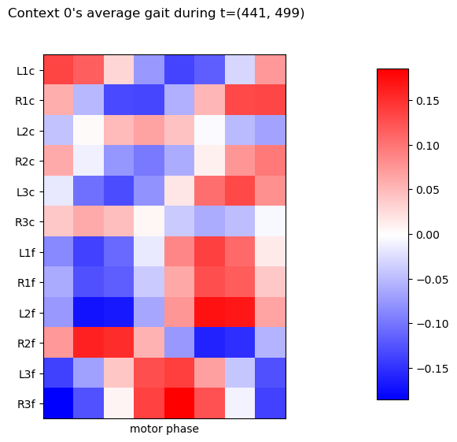

# Bootstrapping Internal Models augmented with Central Pattern Generator 
This package implements bootstrapping algorithm that actively learns Internal Models
augmented with Central Pattern Generator (CPG-IM) [1]. The CPG-IM ensemble models and controls
rhythmic motion, *gait*, in order to reach given target behavior. 

The experiment run by this package demonstrates following functionalities of the CPG-IM ensemble:
1. Incremental goal-oriented gait dynamics model learning,
2. Damage detection,
3. Gait control inference.

## Installation
The software is tested on Windows 11 and Ubuntu 20.4. To run the experiments the python libraries and the simulator must be installed:

1. The software requires Python 3.8.0 with packages listed in *requirements.txt* file.
To install the requirements run:
```setup
pip3 install -r requirements.txt
```

2. The robot is simulated in [CoppeliaSim](https://www.coppeliarobotics.com/downloads) 
which should be installed on your machine (tested on EDU distribution version 4.3.0).


## Training the Internal Model Ensemble

>Before running the experiment in the simulator, we encourage you to try this [Jupyter Notebook Demo](mass_spring_damper_demo.ipynb), where we train
to control simple mass-spring-damper system. You will see how the *internal model* learns to
control a low-dimensional system. The demo will also introduce you to the *DynSys framework*
which numerically solves differential equations. 

### Experimental Setup
We run the experiment where the simulated robot learns multiple internal models, which provides the
robot with appropriate control. During the experiment the robot experiences leg damage, which the
controller must learn to compensate.

### Running the experiment
First we prepare the simulated environment:
1. Launch CoppeliaSim
2. Open the ```resources\scenes\plane.ttt``` scene.

You should see the hexapod robot which we are about to make move.


Now we just run the python script
```train
python3 train.py <experiment_run_tag> <number_of_iterations>
```
where *experiment_run_tag* can be any string which will identify the experiment run, and *number_of_iterations* is number of numerical integration steps.
> Set the *number_of_iterations* at most to 400 000.
> However such run could take 3 hours (Ubuntu20.4, Intel I7, 16GB RAM). 
> We recommend you to separate the run into shorter runs.
> Just run the 200 000 iterations twice, the results are then automatically merged.

For more options consult 
```train
python3 train.py -h
```

The robot should start randomly moving with its legs (motor-babbling). Usually it starts walking at 100 000th iteration.
The leg paralysis is introduced at 150 000th iteration.

### Results analysis

The entire run is stored in the hdf5 file(s) in the ```results\vrep_poc``` directory. And now we simply analyse
the stored data. Just run
```eval1
python3 evaluate.py <experiment_run_tag>
```
and new directory ```results\nn\<experiment_run_tag>``` will be generated with plotted data. 

For more options consult 
```train
python3 evaluate.py -h
```

Now we describe what each plot is supposed to show.  

### Results

#### The CPG-IM bootstrapping overview
\
The colors of the top bar distinguish activity of different internal models (IMs).
The activity and whether the IM is in the *Learning* or *Controlling* stage is determined by the Estimation Error.
In the Velocity and Yaw subplots we can see evolution of respective sensory observations.
During *Learning* the IM generates motor-babbling while during *Controlling* the IM tries to approach the target behavior (green).
How well the IM controls the robot is measured by Performance control at the bottom.
The behavior of the system is changed by introduced damage (red vertical line).

#### Movement of the robot on XY coordinate plane
\
The trajectory of the robot is shaped by different IMs which are in control.
Each marker color corresponds to IM that is in *Controlling* stage during traversal (colors also corresponds to the figure above).

#### Transit between Internal Models
\
\
Each transition occurs because a *Controlling* IM is has too high Estimation Error.
After transition a new IM starts *Learning*.

#### Leg damage event
\
As the damage occurs, the estimation and reality diverge.
Thus the Estimation Error grows until eventually the damage is detected.

#### Gait pattern statistics
We show gaits inferred during the *Controlling* stage of each IM.\

\
Each matrix show the command that was send during the particular *motor phase* (column) to the particular *joint*(row).
We show the average of these values and their standard deviation, which indicate which joints were changed the most.\

\
The second IM usually generates gaits that are able to crawl in given direction.\

\
The third IM usually compensates the introduced middle-left coxa paralysis (L2c).

\
Each joint label is composed of leg label (above) and proximity label: *c* for body-coxa and *f* for coxa-femur joint.
#### Learned weights
Each pair of sensor and motor has an unique interaction which is learned by the IM.
Whe show portfolio of all trained parameters for each IM.
> The weight matrix is shown on simpler example at the end of the [Jupyter Notebook Demo](mass_spring_damper_demo.ipynb). 


[//]: # (## Pre-trained Model)

[//]: # (We provide pretrained model on [Google Drive]&#40;https://drive.google.com/drive/folders/1MLSIO0b1cgfyAUp4vYoweAD2h8_wvRVX?usp=sharing&#41;.)

[//]: # (Download and put all parts into the ```results\vrep_poc``` directory. Then run)

[//]: # (```eval)

[//]: # (python3 evaluate.py 030722_d)

[//]: # (```)

[//]: # (which should generate the same figures as we show above.)


[1] R. Szadkowski and J. Faigl, Internal Models With Central Pattern Generator Estimate and Control Gait Dynamics, 
(unpublished)
